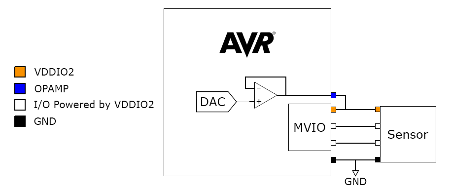

<!-- Please do not change this html logo with link -->

#  Using the Internal Op Amp as Regulated Power Supply for MVIO on AVR® DB MCUs

A new feature introduced in the AVR® DB family is the Analog Signal Conditioning (OPAMP) peripheral. In these examples, the OPAMP is used as an adjustable power supply. This eliminates the need for an external power supply for a second voltage domain. One op amp is configured as a voltage follower and its output is connected to VDDIO2+ (positive terminal of second voltage domain).

These MPLAB MCC Melody configured examples describe use cases for the OPAMP as regulated power supply on the AVR® DB family of microcontrollers:

* [**Voltage reference using the internal resistor ladder**](using-internal-resistor-ladder.X):  
  This scenario shows how to use the internal resistor ladder of the OPAMP as a voltage reference for a second voltage domain.

	

	
  
* [**Voltage reference using external resistors**](using-external-resistors.X):  
  This scenario shows how to use external resistors as a voltage reference for a second voltage domain.

	

  
* [**Voltage reference using the internal DAC**](using-internal-dac.X):  
  This scenario shows how to use the internal DAC as a voltage reference for a second voltage domain. 

	

* [**Voltage reference using the internal ADC**](monitoring-opamp-output-with-adc.X):  
  This scenario shows how to use the internal ADC as a voltage reference for a second voltage domain.

	

## Related Documentation

* [AN3636 - AVR128DB48 Using the Internal OPAMP as Regulated Power Supply for MVIO](https://microchip.com/DS00003636) 
* [AVR128DB48 Device Page](https://www.microchip.com/wwwproducts/en/AVR128DB48)
* [AVR128DB48 Curiosity Nano User Guide](https://www.microchip.com/DS50003037)

## Software Used

Microchip’s free MPLAB X IDE, compiler and MPLAB Code Configurator (MCC) graphical code generator are used throughout the application firmware development to provide easy and hassle-free user experience. Following are the tool versions used for this example:

* MPLAB® X IDE 5.50 or newer [(https://www.microchip.com/mplab/mplab-x-ide)](https://www.microchip.com/mplab/mplab-x-ide)
* XC8 Compiler 2.32 or a newer compiler [(https://www.microchip.com/mplab/compilers)](https://www.microchip.com/mplab/compilers)
* MPLAB® Code Configurator (MCC) 4.1.0 or newer [(https://www.microchip.com/mplab/mplab-code-configurator)](https://www.microchip.com/mplab/mplab-code-configurator) 
* MPLAB® Melody Library 1.84.3 or newer [(https://www.microchip.com/mplab/mplab-code-configurator)](https://www.microchip.com/mplab/mplab-code-configurator)
* MCC Device Libraries 8-bit AVR MCUs 2.8.0 or newer [(https://www.microchip.com/mplab/mplab-code-configurator)](https://www.microchip.com/mplab/mplab-code-configurator)
* Microchip AVR128DB48 Device Support Pack AVR-Dx_DFP (1.8.112) or newer [(https://packs.download.microchip.com/)](https://packs.download.microchip.com/)

## Hardware Used

* AVR128DB48 Curiosity Nano [(EV35L43A)](https://www.microchip.com/DevelopmentTools/ProductDetails/PartNO/EV35L43A)
* For the *"Voltage reference using external resistors"* example: two resistors (values based on desired voltage level)

## Setup

* Set the CNANO VDD to 5V, using the interface in MPLAB X (project configuration - target - target voltage) or by dragging and dropping a .txt file with only the string "CMD:5V0" onto the "CURIOSITY" mass storage device that appears when the kit is connected to a PC
* Prepare CNANO board for second voltage domain (VDDIO2):
1. Remove the 0-ohm resistor right below the VDDIO2 label to cut the connection between VDD and VDDIO2
2. Connect a wire between PD2 and VDDIO2+, as shown in image below. This physically connects the output of the internal op amp (OP0) to VDDIO2+ (positive terminal for secondary voltage domain).

	

	

* Enable Dual Supply mode in the System Configuration 1 (SYSCFG1) fuse
* Enable MVIO powered by internal op-amps on the development board, see readme under each project/scenario as well as in the [application note](https://microchip.com/DS00003636)

## Operation

* Download the zip archive or clone the example to get the source code
* Open the project you want to run in MPLAB® X or MPLAB® Xpress IDE
* Set the project as Main project by right clicking the project name in the *Projects* window (Ctrl+1) and select *"Set as Main Project"* from the drop-down menu
* Program the AVR128DB48 Curiosity Nano: 
	* First clean and build the project by pressing the *Clean and Build Main Project* button
	
	
	
	* Then make and program the project to the AVR128DB48 by clicking the *Make and Program Device Main Project* button
	
	
* If no tool has been selected, a window will open. Select the AVR128DB48 Curiosity Nano tool. The tool can also be selected in the project property settings (*Connected Hardware Tool*). 

## Conclusion
After going through this example, you should have a better understanding of how to set up the OPAMP peripheral as a regulated power supply.
