<!-- Please do not change this html logo with link -->

# Voltage Reference Using the Internal DAC

This scenario shows how to use the internal DAC as a voltage reference for a second voltage domain.

	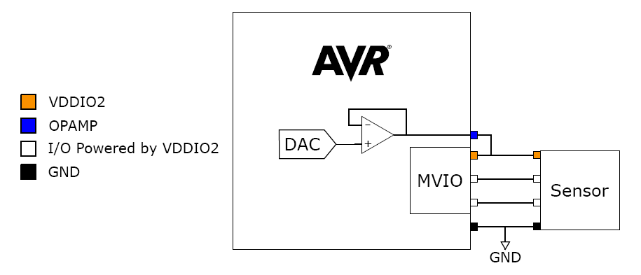

## Related Documentation

* [AN3636 - AVR128DB48 Using the Internal OPAMP as Regulated Power Supply for MVIO](https://microchip.com/DS00003636) 
* [AVR128DB48 Device Page](https://www.microchip.com/wwwproducts/en/AVR128DB48)
* [AVR128DB48 Curiosity Nano User Guide](https://www.microchip.com/DS50003037)

## Software Used

Microchip’s free MPLAB X IDE, compiler and MPLAB Code Configurator (MCC) graphical code generator are used throughout the application firmware development to provide easy and hassle-free user experience. Following are the tool versions used for this example:

* MPLAB® X IDE 5.50 or newer [(https://www.microchip.com/mplab/mplab-x-ide)](https://www.microchip.com/mplab/mplab-x-ide)
* XC8 Compiler 2.32 or a newer compiler [(https://www.microchip.com/mplab/compilers)](https://www.microchip.com/mplab/compilers)
* MPLAB® Code Configurator (MCC) 4.1.0 or newer [(https://www.microchip.com/mplab/mplab-code-configurator)](https://www.microchip.com/mplab/mplab-code-configurator) 
* MPLAB® Melody Library 1.84.3 or newer [(https://www.microchip.com/mplab/mplab-code-configurator)](https://www.microchip.com/mplab/mplab-code-configurator)
* MCC Device Libraries 8-bit AVR MCUs 2.8.0 or newer [(https://www.microchip.com/mplab/mplab-code-configurator)](https://www.microchip.com/mplab/mplab-code-configurator)
* Microchip AVR128DB48 Device Support Pack AVR-Dx_DFP (1.8.112) or newer [(https://packs.download.microchip.com/)](https://packs.download.microchip.com/)

## Hardware Used

* AVR128DB48 Curiosity Nano [(EV35L43A)](https://www.microchip.com/DevelopmentTools/ProductDetails/PartNO/EV35L43A)

## Peripherals Configuration using MCC

### Added Peripherals
* Add the **OPAMP** peripheral
* Add the **DAC0** peripheral  
* The **VREF** peripheral is added automatically when adding the DAC  
  These are found under *Drivers* in the *Device Resources* window.
  
* The following System peripherals are added automatically:
  * **CLKCTRL**
  * **Configuration Bits**
  * **Interrupt Manager**
  * **Pins**

**Main** is not a peripheral and having this included means that the *main.c* file is created automatically by the MCC Melody framework. There is no set up associated with this.

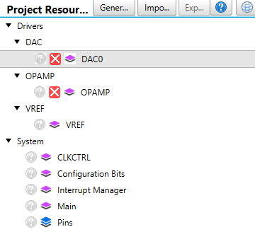

### System Configuration
The added peripherals will show up in the *Builder* window of **MCC Melody** like shown below. Click on each peripheral block to get to each peripheral’s driver configuration **Easy View**.  

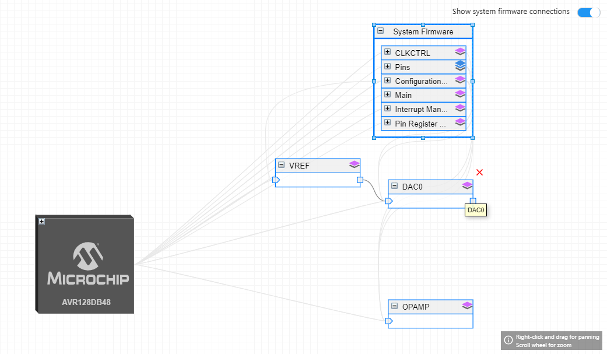

### System Configuration: CLKCTRL

The default clock configuration is used, no changes are needed. The **CLKCTRL** Easy View should look like the picture below.  

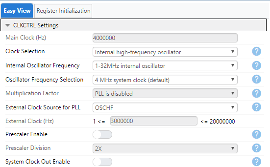  

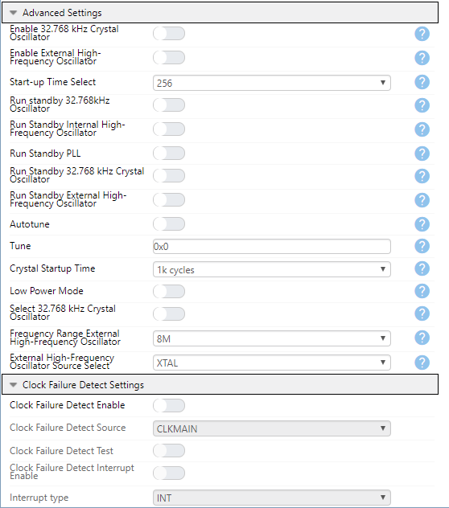

### System Configuration: Configuration Bits

The default configuration for **Configuration Bits** are used and should look like shown below. Make sure that *MVIO System Configuration* is set to "Deviced used in a dual supply configuration".  

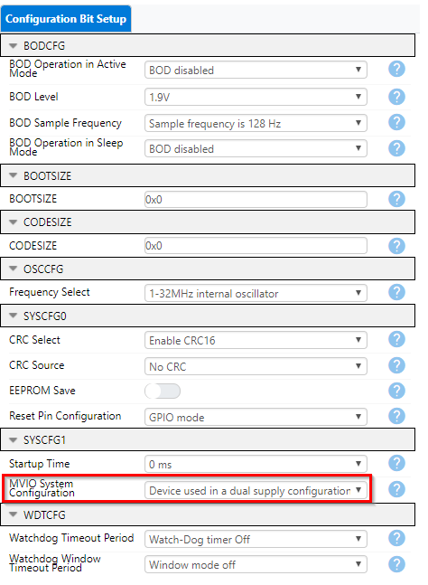

### System Configuration: Interrupt Manager

Use the default setup for **Interrupt Manager**, no interrupts are used in this example.  

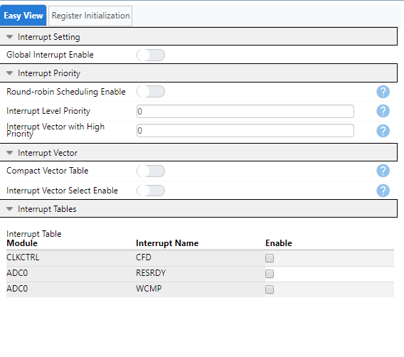

### System Configuration: PINS

The **PINS** configuration is made up of two boxes: the *Pins Grid View* and the *Pins* configuration box.

In the *Pins Grid View*, no changes are needed. The op amp 0 output pin (PORTD pin 2) and the DAC0 output pin (PORTD pin 6) will be automatically highlighted green and show as "locked" during configuration. Note that the screen shot shows final PINS configuration, after all peripherals are configured. This will initially look different, before the OPAMP module is configured.  

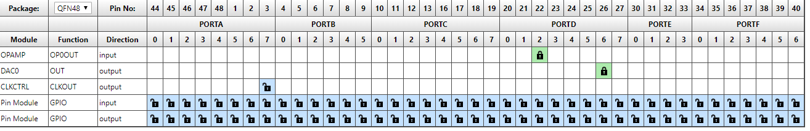

In the *Pins* configuration box, now the pins that are added will show in column *Pin Name* (PD1 & PD2). In column *Custom Name* the example is keeping the default name ("IO_PD1" & "IO_PD2"), but this could be any name of your choosing. Note also here that initially more pins will show up, and the screenshot shown is after all peripherals are configured.  

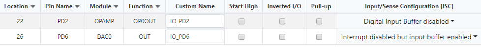

### VREF Configuration

* Enable VREF for DAC by turning on the "Enable Force DAC Voltage Reference"
* Sett the DAC voltage reference source to "VDD as reference" 

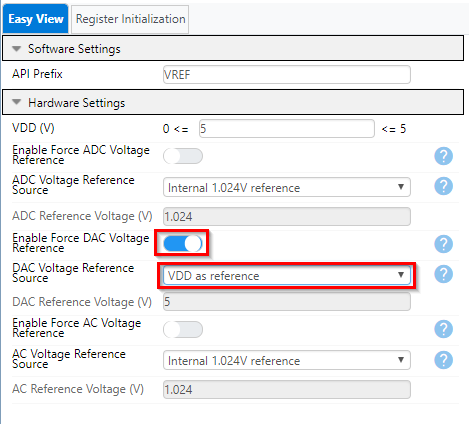

### DAC0 Configuration

* Turn on "Enable DAC"
* Turn on "Enable Output on DAC"

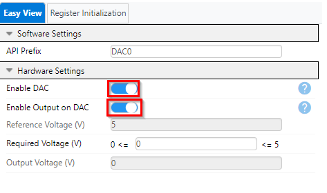

### OPAMP Configuration

* The **OPAMP** system must be enabled by turning on the "Enable OPAMP System" button
* Set the input range to "FULL"
* Select mode "SINGLE OPAMPs"
* Enable OP0 by turning on button "Enable OP0"
* Set OP0 to "Voltage Follower" configuration 
* Disable OP1 and OP2 by turning off buttons "Enable OP1" and "Enable OP2"  

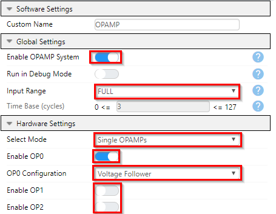  

* Set positive input MUX to "DAC output"
* In this example we have set "Run in Standby Mode" on, this is optional and should be enabled if you want the OPAMP to be running if you put the MCU in sleep mode
* Output Mode should be set to normal
* Software Enable should be set to "Always On"
* Settle Time should be set to 127 us

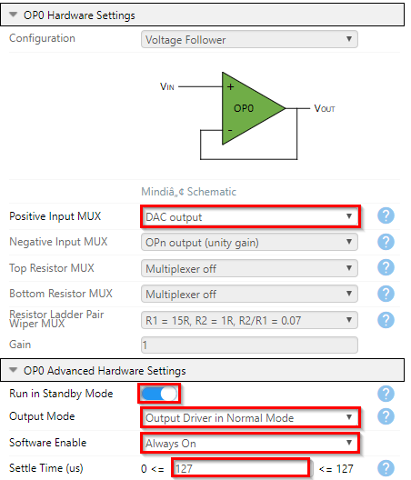

## Setup

* Note that this is one example in the series *Using the Internal Op Amp as Regulated Power Supply for MVIO*. See the series readme for more information.
* Follow the steps in the series readme to set the AVR128DB48 Curiosity Nano (CNANO) board VDD to 5V and enable second voltage domain VDDIO2, or see [application note](https://microchip.com/DS00003636) for details
* Configure the internal DAC to give the desired voltage level for VDDIO2 as described in the **Peripheral Configuration** section as well as in the [application note](https://microchip.com/DS00003636)
* Add needed code lines to the *main.c* as described in the [application note](https://microchip.com/DS00003636). This can also be found in the code example.

## Operation

* Download the zip archive or clone the example to get the source code
* Open the project you want to run in MPLAB® X or MPLAB® Xpress IDE
* Set the project as Main project by right clicking the project name in the *Projects* window (Ctrl+1) and select *"Set as Main Project"* from the drop-down menu
* Program the AVR128DB48 Curiosity Nano: 
	* First clean and build the project by pressing the *Clean and Build Main Project* button
	
	
	
	* Then make and program the project to the AVR128DB48 by clicking the *Make and Program Device Main Project* button
	
	
* If no tool has been selected, a window will open. Select the AVR128DB48 Curiosity Nano tool. The tool can also be selected in the project settings. 

## Conclusion
After going through this example, you should have a better understanding of how to set up the OPAMP peripheral as a regulated power supply using the internal DAC.
